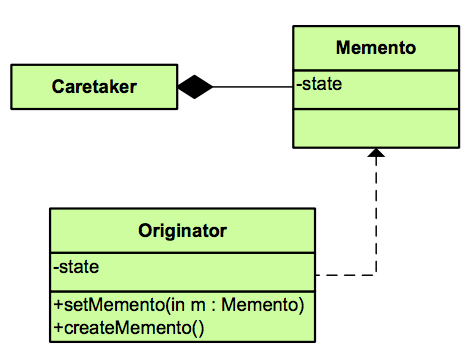

💾 Memento Pattern

```
Without violation encapsulation, capture and externalize and object's internal state so that the object can be restored to this state later.
```

[Contribution guidelines for 23GoF](../../readme.md)


